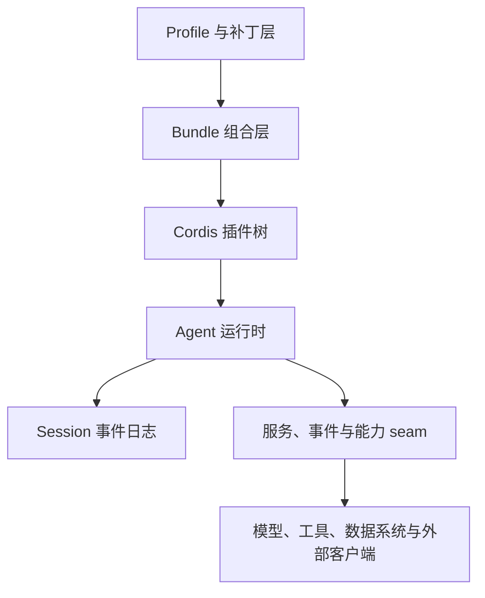
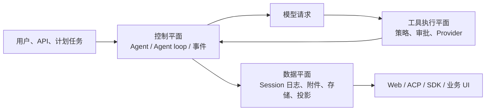
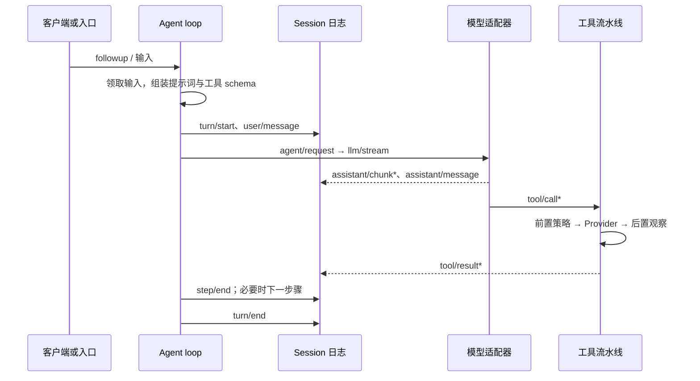

# 系统架构：从组合到一次 Agent 运行

本页从二次开发视角概括运行时结构。精确的服务、事件和类型定义由[架构文档](../architecture.zh.md)、[能力 seam 图](../capability-seams.zh.md)和[子系统参考](../subsystems/README.zh.md)维护。

## 运行时的四层

| 层 | 当前机制 | 二开时的责任 |
| --- | --- | --- |
| Profile 与补丁 | Profile 依次叠加 Bundle、Profile 补丁、Harness home 补丁和 `--patch` overlay。补丁按条目 id 替换整段 `config`，不进行深度合并。 | 为客户、环境或场景选择组合；覆盖配置时重写该条目保留的全部字段。 |
| Bundle | `dsh-base` 提供模型、工具、会话持久化、权限、凭据和运行时主干；Web 与 headless Bundle 添加不同交互表面。 | 把可复用的部署能力打包，避免把客户策略散落到启动脚本。 |
| Cordis 插件树 | 每个插件通过 `ctx.effect()`、`ctx.on()` 或 waterfall 监听贡献可卸载的服务和注册。 | 新行为作为插件加入现有扩展点；卸载必须撤销注册和持有资源。 |
| Agent 运行时与日志 | Agent 驱动一次或多次步骤，Session 事件日志记录可重放的事实。 | 把会影响模型历史、UI 回放或审计的输入明确记录为会话事件。 |

Profile 解决“部署装入什么”，插件解决“运行时如何协作”。两者不要混用：把环境变化写到配置层，把稳定业务逻辑放到插件或包中。

## 三个平面

控制平面包含 `ctx.agents`、Agent loop、实时 `agent/*` 事件和工具流水线。它决定输入何时被领取、何时发出模型请求、何时停止或继续下一步骤。

工具执行平面包含 `ctx.tools`、`tools/pre-execute`、`tools/execute`、`tools/post-execute` 和 `tools/result`。它将“模型提出的调用”变为“通过策略、权限、超时和 Provider 后的结果”。高风险外部动作必须在这个平面执行授权，而不是仅靠提示词约束。

数据平面包含 Session 事件日志、持久化后端、附件、非会话 storage、投影和查询。它服务于恢复、回放、审计、标题、搜索和 UI；它不等同于业务数据库。跨会话、跨用户、领域实体等非对话数据应进入 `ctx.storage`/`ctx.storageDomain` 或外部系统。

## 一次轮次如何发生

一个 turn 可以包含零个或多个 step。每个 step 是一次模型请求及其工具调用；模型请求前由 `agent/pre-step` 决定实际进入模型的消息。`agent/request`、`llm/stream` 和三个 `tools/*` 策略事件是 waterfall，监听器必须调用 `next()` 才会继续委托。

“模型可见即已记录”是最重要的边界：任何进入模型请求的新增业务上下文，必须能够从日志重建。业务系统不应把秘密、临时权限令牌或不可审计的外部结果悄悄拼进 prompt。

## 能力 seam 与扩展点

一个能力 seam 有三种角色：Service Definition 声明接口，Service Provider 实现接口，Consumer 在工具、UI 或其他运行时功能中使用它。文件系统、子进程、模型、子 agent、工作流、存储和 Web 都按这一思路拆分。

| 需要的改变 | 首选位置 | 不应首先做的事 |
| --- | --- | --- |
| 接入一个外部业务系统 | 新建业务服务和 Provider；由 Provider 管理认证、速率、重试和目标系统错误。 | 直接在工具 `execute()` 中散落 HTTP 调用。 |
| 让模型使用能力 | 新建工具 Consumer，定义 schema、呈现意图和执行策略。 | 修改 Agent loop 或把权限写进系统提示词。 |
| 增加模型上下文 | `ctx.systemPrompt.section()`、受控 `agent.inject()` 或有日志支持的事件投影。 | 直接修改请求对象而不留下事件。 |
| 增加持久业务状态 | `ctx.storageDomain` 或外部领域存储；会话事实则扩展 `SessionEventMap`。 | 把业务主数据塞进工具结果或进程内 Map。 |
| 协调长任务 | `ctx.jobs`、`ctx.workflowEngine`、`ctx.subagents` 或调度能力。 | 用一个请求内的递归循环假装后台编排。 |
| 接入外部客户端 | ACP、SDK、Web Host 或单独的协议桥。 | 让 UI 直接依赖内部 Provider。 |

## 组合与隔离

Agent Preset 可以给不同会话安装不同的提示词、工具和模型可见能力。Preset 中的服务条目必须使用 `isolate` realm，避免两个 session 的同名服务意外落入进程全局范围。Preset 一旦会话产生历史便不能切换，因为切换会让已记录的工具调用与后来可用工具脱节。

这使产品能够把“平台能力”和“客户能力”分开：平台 Bundle 提供会话、权限、观测、基础工具和外部连接；客户 Preset 或 Bundle 提供角色、领域工具、Skill、业务策略和默认 Provider。

## 面向生产的架构结论

将外部系统当作 Provider，将模型可调用面当作 Consumer，将输入、输出和重要决策记录为 Session 事件或领域数据。这样可以独立替换模型、API 客户端、沙箱和数据源，而不必修改 Agent loop，也能在问题发生后回放“模型见到了什么、调用了什么、为何被拒绝”。
