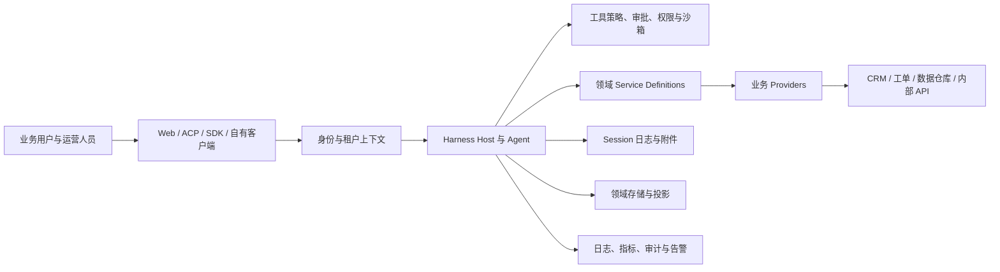

# 生产参考架构：把 Harness 放入企业系统

本页给出推荐的集成边界。它不是仓库自带的部署模板；组织应根据网络、身份、合规、数据驻留和运维要求选择实现。

## 接入边界

| 边界 | 推荐职责 | 不能交给模型决定的内容 |
| --- | --- | --- |
| 客户端入口 | 认证、会话归属、用户身份、租户、请求取消、速率限制。 | 用户是否可访问某个租户、工作区或动作。 |
| Harness Host | Agent 生命周期、模型路由、工具注册、Session 回放、交互协议。 | 外部系统的最终授权和领域事务。 |
| 领域 Service | 业务动作、输入规范化、授权上下文、稳定错误、审计字段。 | Provider 的传输细节和模型 UI 文案。 |
| Provider | 外部 API/数据库、凭据、连接池、重试、限流、幂等和结果转换。 | 任意模型生成的租户范围或未经授权的资源 id。 |
| 数据系统 | 领域真源、长期保留、合规删除和跨系统一致性。 | 将会话日志当成它的替代品。 |

## 身份、租户与凭据

将“谁在操作”“代表哪个租户”“可访问哪个资源”作为入口到领域 Service 的显式上下文。Session 可记录操作归属和审计所需事实，但不应作为唯一授权来源。恢复 Session 时，仍应以当前认证和当前权限重新检查外部写操作。

凭据通过凭据服务或平台的密钥管理系统按请求解析。模型、工具参数、Session 日志、错误消息和 telemetry 都不应携带明文密钥。为不同客户或环境配置独立的凭据引用、Provider route 和访问范围，避免一个全局 token 承担所有租户权限。

## 数据分类和保留

| 数据 | 建议位置 | 典型保留与访问原则 |
| --- | --- | --- |
| 对话与工具事实 | Session 日志和附件存储 | 为恢复、回放、质量分析保留；按会话 owner 与企业策略控制读取。 |
| 业务主数据 | 权威业务系统 | 由领域系统的合规、删除、备份和权限机制处理。 |
| 跨会话辅助状态 | storage domain 或专门数据库 | 有 schema、版本、租户键和迁移路径。 |
| 搜索索引、摘要、缓存 | 可重建投影 | 明确来源、失效和重建策略，不能替代真源。 |
| 观测数据 | 日志/指标/追踪系统 | 先定义脱敏和导出范围；默认不把原始客户内容发送到外部。 |

`dsh-session-telemetry-otel` 的默认组合是关闭的，启用前应审查其导出内容、目标端点、数据处理协议和用户告知方式。Session 全文检索也应按数据分级决定是否开启及其存储位置。

## 执行控制

把外部动作设计为“计划—批准—执行—记录—观察”闭环。查询可直接返回；产生草稿的建议不写外部系统；写入动作由工具策略和 Provider 双重检查；长任务注册为 Job 或 Workflow，并提供读取、取消和超时后的恢复说明。

Sandbox 用于控制本地进程和文件效果，不能替代 API 级授权。Approval 用于人与 agent 的交互，不能替代领域系统的职责分离或审批链。两者必须与业务 Provider 的最小权限 token 配合。

## 可靠性与可运营性

每个 Provider 都应设置可验证的超时、重试范围、并发与批量上限，并区分可安全重试的临时错误和不可重试的业务拒绝。每次外部写入都应保留业务操作 id、幂等键或可查询的状态，使重试和人工接管不会重复产生副作用。

需要持续观察的指标包括：请求与工具成功率、拒绝与审批率、Provider 延迟和限流、模型与工具成本、会话失败原因、后台任务时长、人工接管率、被用户采纳的建议比例，以及从提出到完成的业务周期。指标应服务于一个明确决策，而不是无差别记录全部 prompt 与结果。

## 部署演进

从单一客户、单一 Provider、只读工具和人工复核开始。验证授权、审计和恢复后，再增加可撤销写入、后台任务和多数据源路由。只有在真实客户需要隔离的配置、语言、工具集或流程稳定出现后，才把它们抽成 Preset、Bundle 或新的 Service Provider。
